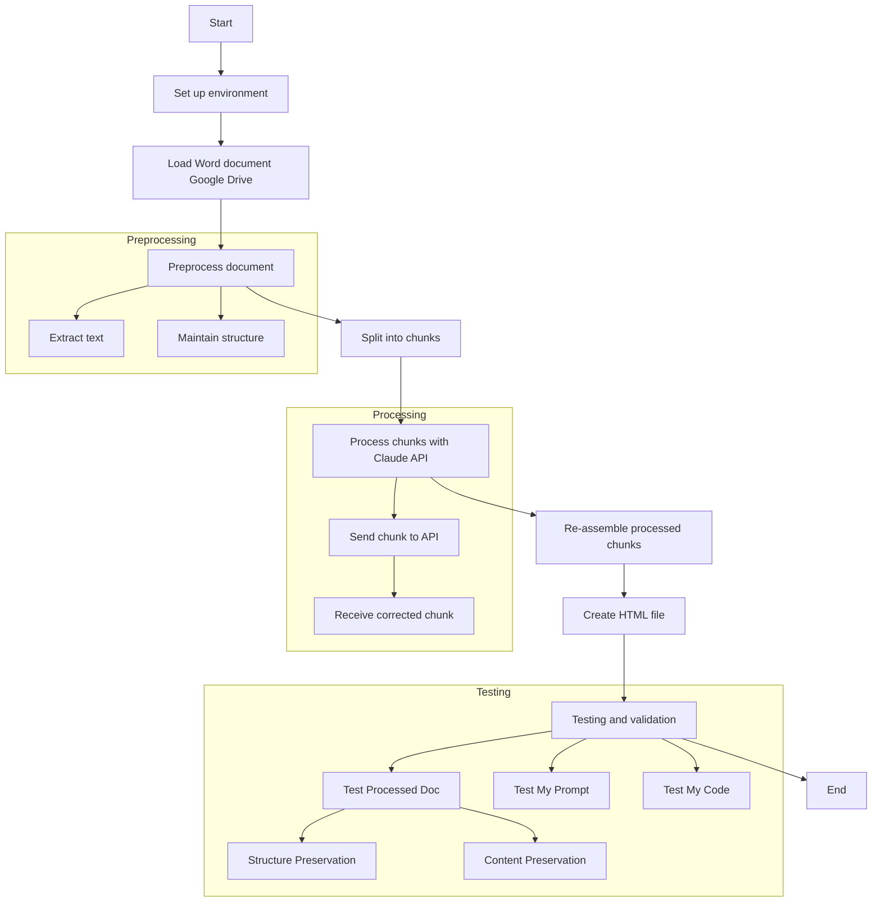

## Solution Diagram
Generated from notebook code.

```mermaid
graph TD
    A[Start] --> B[Set up environment]
    B --> C[Load Word document Google Drive]
    C --> D[Preprocess document]
    D --> E[Split into chunks]
    E --> F[Process chunks with Claude API]
    F --> G[Re-assemble processed chunks]
    G --> H[Create HTML file]
    H --> I[Testing and validation]
    I --> J[End]

    subgraph "Preprocessing"
    D1[Extract text]
    D2[Maintain structure]
    D --> D1
    D --> D2
    end

    subgraph "Processing"
    F1[Send chunk to API]
    F2[Receive corrected chunk]
    F --> F1
    F1 --> F2
    end

    subgraph "Testing"
    I1[Test Processed Doc]
    I2[Test My Prompt]
    I3[Test My Code]
    I --> I1
    I --> I2
    I --> I3
    I1 --> I1A[Structure Preservation]
    I1 --> I1B[Content Preservation]
    end
```
